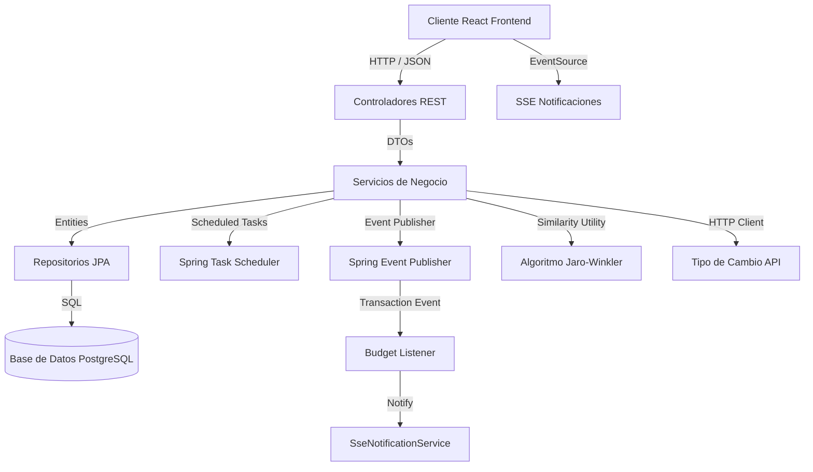
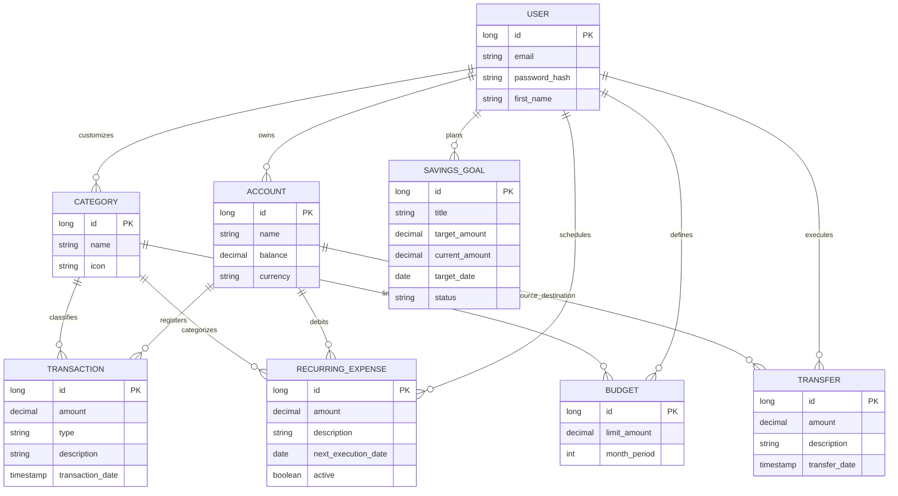

# Gestor de Gastos — Personal Finance Tracker

Aplicación web para la administración y control de finanzas personales, construida con un backend en Spring Boot y un frontend en React. La aplicación permite consolidar múltiples cuentas en distintas divisas, gestionar presupuestos mensuales, automatizar cobros recurrentes y definir metas de ahorro.

---

## 🏛️ Arquitectura del Sistema

El proyecto implementa un modelo cliente-servidor desacoplado con una API REST en el backend y una interfaz de usuario SPA (Single Page Application) en el frontend.

### Diagrama de Arquitectura



### Capas del Backend
* **Controllers:** Exponen los endpoints RESTful, validan payloads de entrada (`@Valid`) y manejan las peticiones.
* **DTOs (Data Transfer Objects):** Desacoplan las entidades de base de datos de la API de entrada/salida.
* **Services:** Concentran la lógica de negocio y la demarcación transaccional (`@Transactional`).
* **Listeners / Events:** Gestionan la intercomunicación de servicios de manera desacoplada mediante eventos de Spring.
* **Repositories:** Interfaces que heredan de `JpaRepository` para la persistencia de datos.
* **Models:** Entidades JPA que representan el esquema de base de datos e integran auditoría temporal (`created_at` y `updated_at`).

---

## ⚙️ Características Técnicas Clave

1. **Autenticación con JWT:** Seguridad basada en tokens JWT sin estado (stateless) y contraseñas encriptadas mediante `BCrypt`.
2. **Desacoplamiento por Eventos (Patrón Observer):** Al registrar una nueva transacción, se publica un evento síncrono `TransactionCreatedEvent`. El módulo de presupuestos (`BudgetListener`) reacciona al evento, calcula acumulados mensuales y, si se supera el presupuesto, dispara una alerta reactiva al frontend.
3. **Notificaciones en Tiempo Real (SSE):** Uso de Server-Sent Events (`SseEmitter`) para notificar inmediatamente en el frontend si un cobro en segundo plano falla o si una transacción excede el presupuesto límite establecido.
4. **Sugerencia de Categorías (Jaro-Winkler):** Algoritmo de similitud Jaro-Winkler para analizar la descripción escrita por el usuario y sugerir la categoría adecuada basándose en transacciones históricas.
5. **Conversión Multi-moneda:** Conversión de saldos y reportes consumiendo una API externa de tipo de cambio, con una caché local en memoria de 12 horas para evitar latencia. Los cálculos financieros se procesan utilizando `BigDecimal` para evitar errores de precisión de coma flotante.
6. **Débitos Automáticos en Segundo Plano:** Ejecución calendarizada de suscripciones mensuales activas mediante el planificador nativo de Spring Boot (`@Scheduled`).
7. **Rate Limiting:** Filtro de seguridad (`RateLimitingFilter`) que protege la API contra ataques de denegación de servicio (DoS) limitando solicitudes por dirección IP mediante el algoritmo Token Bucket (20 solicitudes/min en autenticación y 100/min en el resto de endpoints).
8. **Exportación Documental:** Endpoints para descargar el historial completo de transacciones en archivos CSV (usando Apache Commons CSV) y en reportes PDF formateados (usando OpenPDF).

---

## 🗄️ Modelo de Base de Datos (DER)



---

## 🛠️ Stack Tecnológico

### Backend
* **Java 25** con **Spring Boot** (Spring Security, Spring Data JPA, Web).
* **PostgreSQL** como motor de base de datos relacional.
* **Hibernate** como ORM / Jakarta Persistence.
* **Bucket4j-core** para el control de tasas de solicitudes (Rate Limiting).
* **OpenPDF & Commons-CSV** para la generación de reportes y descargas.
* **Springdoc-OpenAPI** para la autogeneración interactiva de la API (Swagger UI).
* **Spotless** para linter y formateo automático de código Java.

### Frontend
* **React 19** con **Vite 8** para el empaquetado del cliente SPA.
* **React Context API** para el manejo del estado de sesión y autenticación.
* **Vanilla CSS** para los estilos del tema fintech oscuro de alto contraste.
* **Oxlint** para análisis estático del código React (JS/JSX).

---

## 📦 Instrucciones de Ejecución Local

### Método A: Usando Docker (Recomendado y rápido)

El proyecto cuenta con dockerización completa, por lo que puedes levantar la base de datos, el backend y el frontend con un solo comando sin tener Java o Node instalados localmente.

1. Asegúrate de tener Docker corriendo en tu sistema.
2. Desde la raíz del proyecto, ejecuta:
   ```bash
   docker compose up --build
   ```
3. Accede en tu navegador a:
   * **Frontend:** `http://localhost`
   * **Swagger UI (Documentación de API):** `http://localhost:8080/swagger-ui/index.html`

---

### Método B: Ejecución Manual

#### Prerrequisitos
* JDK 25.
* Node.js (v18 o superior).
* Instancia local o remota de PostgreSQL.

#### 1. Levantar el Backend (Spring Boot)
1. Ingresa a la carpeta del backend:
   ```bash
   cd backend
   ```
2. Configura los parámetros de tu base de datos y JWT en `src/main/resources/application.properties`:
   ```properties
   spring.datasource.url=jdbc:postgresql://localhost:5433/gestorgastos
   spring.datasource.username=tu_usuario
   spring.datasource.password=tu_contraseña
   spring.jpa.hibernate.ddl-auto=update
   
   jwt.secret=5367566B59703373367639792F423F4528482B4D6251655468576D5A71347437
   jwt.expiration=86400000
   ```
3. Ejecuta la aplicación utilizando Maven:
   ```bash
   mvn clean compile
   mvn spring-boot:run
   ```
El servidor iniciará por defecto en `http://localhost:8080`.

#### 2. Levantar el Frontend (React)
1. Abre otra terminal e ingresa a la carpeta del frontend:
   ```bash
   cd frontend
   ```
2. Instala las dependencias:
   ```bash
   npm install
   ```
3. Inicia el servidor de desarrollo:
   ```bash
   npm run dev
   ```
La aplicación web estará disponible en `http://localhost:5173`.

---

## 🔑 Datos de Prueba (Seeding Automático)

Al iniciar el backend por primera vez, `DataInitializer.java` sembrará automáticamente datos de prueba iniciales en la base de datos si esta se encuentra vacía.

### Credenciales Demo
* **Email de acceso:** `demo@gestorgastos.com`
* **Contraseña:** `password123`

---

## 🧪 Tests y Calidad de Código

* **Ejecutar Pruebas Unitarias (JUnit 5 + Mockito):**
  ```bash
  cd backend
  mvn test
  ```
* **Aplicar Formato en Java (Spotless):**
  ```bash
  cd backend
  mvn spotless:apply
  ```
* **Ejecutar Linter en React (Oxlint):**
  ```bash
  cd frontend
  npm run lint
  ```
